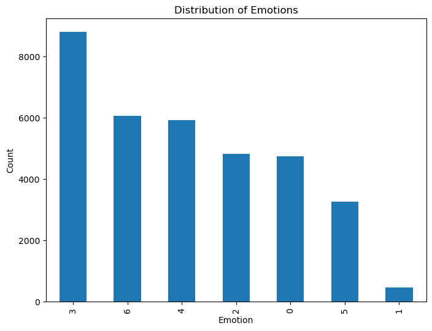
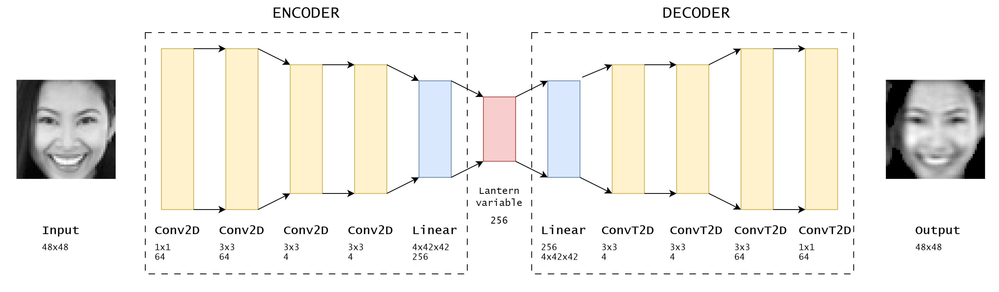
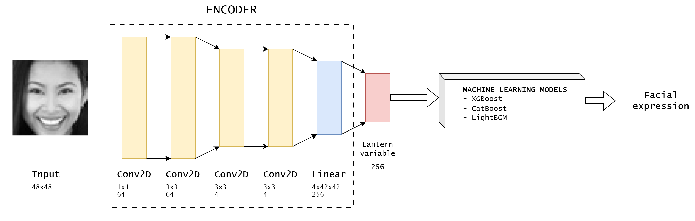

# Mini-Project for Fundamentals of Machine Learning Course


## 📑 Project Policy
- Team: 

    |No.| Student Name    | Student ID |
    | --------| -------- | ------- |
    |1|Trịnh Minh Anh| 21280005|
    |2|Nguyễn Phúc Gia Nghi| 21280035|
    |3|Nguyễn Lưu Phương Ngọc Lam| 21280096|

## 📌 Problem Introduction
Utilizing Machine Learning algorithms for the topic of facial expression recognition classification in our third-year final mini-project, we aim to systematically present our methodology, thoroughly analyze the results, and draw comprehensive conclusions. 

**Problem:** Given a set of grayscale images of faces represented as pixel arrays, our task is to build a model that detects facial expressions from the input images. This type of problem is known as the *Facial Expression Recognition Challenge (FER2013)*
- The input: A set of images depicting emotions, with each emotion assigned a numerical label in one of seven categories.
- The output: The trained models capable of predicting the expression from new facial image data.


## 🧩 Data Exploring
Regarding the EDA section, we summarized the information as follows:
- Our dataset comprises 7 labels with specific encodings: 0=Angry, 1=Disgust, 2=Fear, 3=Happy, 4=Sad, 5=Surprise, 6=Neutral.
- The dataset is free of NaN values.
- There is one image contains one unique value, meaning this image consists entirely of one color.
- Some duplicate images have been found and removed.
- There exists an imbalance in the distribution of labels, notably with label 1 appearing significantly less frequently compared to the other labels

    

## 🔍 Methodology Overview
In this study, we will use 4 models: XGBoost, CatBoost, LightGBM, and MLP. The model application will be based on 3 types of input data: the original data (before PCA), the data after applying PCA, and the data processed using an AutoEncoder. 

### XGBoost (eXtreme Gradient Boosting)
XGBoost is a powerful ensemble learning algorithm that enhances prediction accuracy through gradient boosting. The core idea is to iteratively add decision trees to minimize the residual errors of previous models.

**Model Training:**

- Handle imbalanced classes by computing class weights and scaling the positive class weight accordingly.
- Define the XGBoost model with parameters like maximum depth, tree method, and device setting.
- Use a grid search to optimize hyperparameters such as the number of `estimators`, `gamma`, `regularization terms`, and `learning rate`.


### CatBoost (Categorical Boosting)
CatBoost is tailored to efficiently handle categorical features, which are common in FER datasets. It uses ordered boosting and permutation techniques to manage categorical data during training.
Model Training:

- Compute class weights to handle imbalanced classes.
- Define the CatBoost model with parameters like depth and task type (GPU).
- Use a grid search to optimize hyperparameters such as `learning rate`, `iterations`, and `L2 regularization`.
### LightGBM (Light Gradient Boosting Machine)
LightGBM focuses on training efficiency and scalability. It employs techniques like Gradient-based One-Side Sampling (GOSS) and Exclusive Feature Bundling (EFB) to enhance performance.

**Model Training:**

- Compute class weights to handle imbalanced classes and create a class weight dictionary.
- Define the LightGBM model with parameters such as objective, number of classes, and device setting (GPU).
- Create a pipeline combining feature scaling and the LightGBM classifier.
- Use a grid search to optimize hyperparameters like the number of `leaves`, `learning rate`, number of `estimators`, `max depth`, and `regularization terms`.

### MLP (Multi-Layer Perceptron)
An MLP belongs to a class of feedforward artificial neural networks. It has the remarkable capability of capturing intricate patterns in data through the use of multiple layers of neurons, each employing non-linear activation functions. 

**Model Architecture:** The model consists of three fully connected (dense) layers:
- The input layer is responsible for receiving the initial flattened input features. 
- The hidden layers consist of two layers, one with **128 neurons** and another with **32 neurons**. Each hidden layer is followed by an `Exponential Linear Unit` (ELU) activation function and batch normalization, which enhance learning stability and convergence. 
- The output layer generates a vector of size 7, corresponding the different facial expression classes. It applies a `softmax` activation function to produce probability distributions across these classes.

**Model Training:**

- The MLP is trained using backpropagation with a suitable loss function, such as cross-entropy loss, to minimize the error between predicted and actual class labels.
- Optimization algorithms like Adam are used to update the weights and biases of the network during training.


## 💡 Our proposed methods

### Dealing with unbalanced data

At first, we "unzip" data into folders for futher process

```
|- data
    |- images
        |- train
            |- 0
            ...
            |- 6
        |- Valid
            |- 0
            ...
            |- 6
        |- test
            |- 0
            ...
            |- 6
```

<p align="center">
    
</p>

Looking at counting plot above, we can see that our data is heavy unbalaced, so we devided it into train/valid/test subset and then choosed to downsample data having label 3 to 4000 samples and upsample data in training set with label 0, 1, 2, 4, 5, 6 to 4000 using some image augmentation methods: `RandomRotation`, `RandomHorizontalFlip`, `ColorJitter`, `RandomAdjustSharpness` and `Normalize`.

### Image encoding

To encode image, we simply use a simple CNN-based Auto encoder



It can be seen that our auto encoder model can extract features good!

### Facial classification

Then we use pretrained-encoder to vectorize input images into 256 dimensions vectors and pass them into machine learning models to predict facial expression.



## 🚩 Experimental Results

|   | Features Extractor | Model | Accuracy | Precision | Recall | F1-score |
|:-:|:-|:-:|:-|:-|:-|:-|
| **0** | **None** | **XGBoost** | **0.4419** | **0.44** | **0.44** | **0.42** |
| 1 | None | CatBoost | 0.3254 | 0.33 | 0.33 | 0.31 |
| 2 | None | LightGBM | 0.4282 | 0.43 | 0.43 | 0.42 |
| 3 | None | MLP | 0.3628 | 0.31 | 0.36 | 0.33 |
| 4 | PCA  | XGBoost | 0.3266 | 0.32 | 0.33 | 0.31 |
| 5 | PCA  | CatBoost | 0.1780 | 0.03 | 0.18 | 0.05 |
| 6 | PCA  | LightGBM | 0.4272 | 0.06 | 0.25 | 0.10 |
| 7 | PCA  | MLP | 0.4016 | 0.40 | 0.40 | 0.39 |
| 8 | Auto encoder | CatBoost | 0.38 | 0.44 | 0.38 | 0.39 |
| 9 | Auto encoder | XGBoost | 0.41 | 0.41 | 0.41 | 0.41 |
| 10 | Auto encoder | LightGBM | 0.39 | 0.39 | 0.39 | 0.39 |

The above result table indicates that:

| Feature extractor | Descriptions |
|:-|:-|
|Original Data|The XGBoost model achieves the highest accuracy of 0.4419 and an F1-score of 0.42. This indicates that XGBoost performs the best when using the original data. A plausible reason for this is that XGBoost is capable of effectively leveraging the raw features present in the original data without requiring additional preprocessing steps. The model's ability to capture complex interactions within the data likely contributes to its superior performance.|
|PCA data | When using PCA to preprocess the data, the MLP model achieves the highest accuracy of 0.4016 and an F1-score of 0.39. PCA reduces the dimensionality of the data, eliminating noise and potentially speeding up the training process. However, due to some loss of information compared to the original data, the performance is slightly lower. MLP's capability to utilize the transformed features from PCA allows it to achieve the best results among the models using PCA-processed data.|
|Auto Encoder |For data processed through an Auto Encoder, the XGBoost model again achieves the highest scores with an accuracy of 0.41 and an F1-score of 0.41. Auto Encoders learn new feature representations from the data, retaining essential information while removing noise. XGBoost's ability to capitalize on these new feature representations enables it to perform nearly as well as it does with the original data. This highlights XGBoost's versatility and robustness in handling various types of data preprocessing.|
